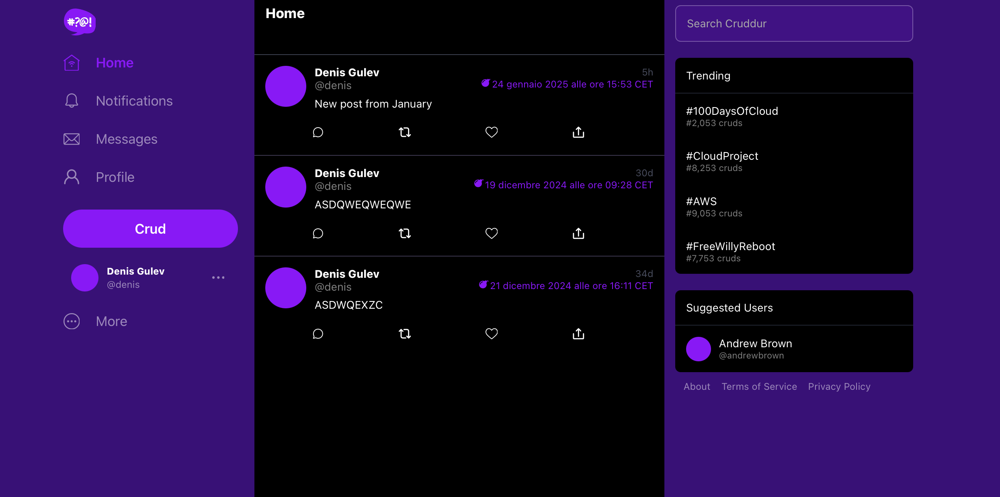

# FREE AWS Cloud Project Bootcamp

- Application: Cruddur

A micro-blogging platform with expiring posts offers a safer, more engaging user experience by reducing personal data exposure, 
limiting harmful content, and fostering community-focused, present-moment interactions. 
Its ephemeral nature drives monetization through increased user engagement, exclusive content, 
and targeted advertising opportunities. Cruddur is designed as an ephemeral-first public micro-blogging platform. 
This unique approach positions Cruddur to build trust and boost engagement.

[Youtube videos](https://www.youtube.com/watch?v=zJnNe5Nv4tE&list=PLBfufR7vyJJ7k25byhRXJldB5AiwgNnWv&index=19) for the free bootcamp

## Journaling Homework

The `/journal` directory contains

- [X] [Week 0](journal/week0.md) Billing and Architecture
- [X] [Week 1](journal/week1.md) App Containerization
- [X] [Week 2](journal/week2.md) Distributed Tracing
- [X] [Week 3](journal/week3.md) Decentralized Authentication
- [X] [Week 4](journal/week4.md) Postgres and RDS
- [X] [Week 5](journal/week5.md) DynamoDB
- [X] [Week 6](journal/week6.md) Deploying Containers to ECS
- [X] [Week 7](journal/week7.md) Solving CORS with a Load Balancer and Custom Domain
- [X] [Week 8](journal/week8.md) Image Upload to S3, API Gateway, Lambda functions (process/upload image, authorize user), AWS CDK
- [ ] [Week 9](journal/week9.md)
- [ ] [Week 10](journal/week10.md)
- [ ] [Week 11](journal/week11.md)
- [ ] [Week 12](journal/week12.md)
- [ ] [Week 13](journal/week13.md)
