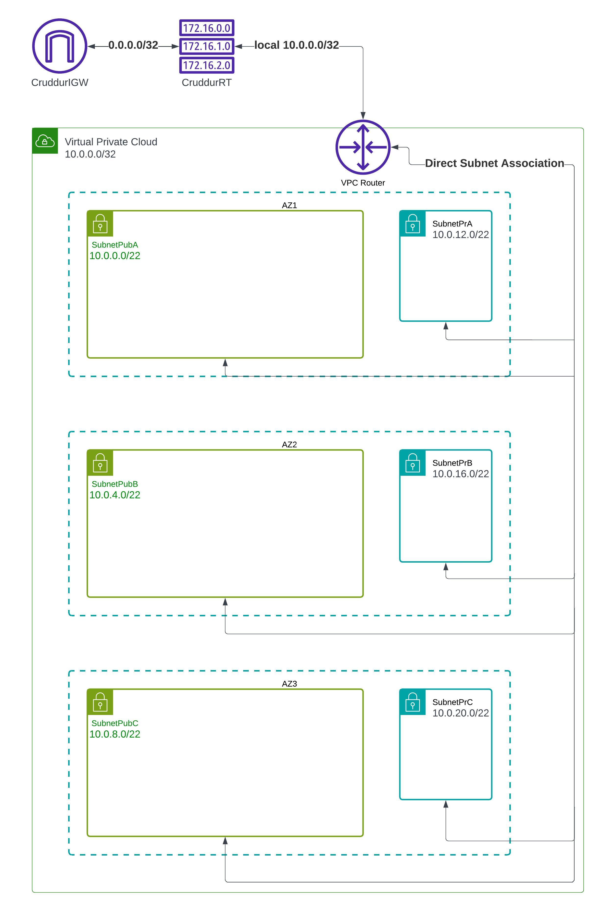
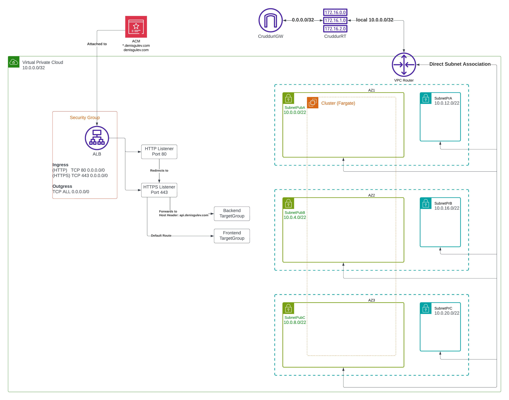

# Week 10 — CloudFormation Part 1

We are going to define multiple layer cloudFormation templates, each containing specifications for particulare resources.

1. Define CloudFormation for ECS fargate
   1. create template for ECS resource
        ```
        AWSTemplateFormatVersion: 2010-09-09
        Description: |
        Setup ECS Cluster
        Resources:
        ECSCluster: # LogicalName
        Type: AWS::ECS::Cluster
        ```
   2. execute "backend-flask/bin/cfn/deploy" script
   3. go to AWS CloudFormation console and review the "changeset"
   4. if everything is ok, go ahead and execute it
   5. in case of errors, take a look at CloudTrail for more details
   6. we can validate the format of our template (json or yaml) using "validate-template" cli command
      or using "cfn-lint"
   7. we can store template in S3 and reference it in the CloudFormation template

    
We'll create multiple layers of CloudFormation templates, each containing specifications for particular resources.

1. Networking -> base networking layer where we deploy service into ("aws/cfn/networking/template.yaml")
   
   In a Template file:
   1. define a VPC resource
   2. define an IGW resource
   3. define a VPCGatewayAttachment resource
   4. define a RouteTable resource
   5. define 2 Routes resources
      1. 1 for the IGW
      2. 1 for the local VPC (setup by default when creating RouteTable)
   6. define Subnet resources
      1. 3 for public subnet
      2. 3 for private subnet
   7. define SubnetRouteTableAssociation resources for each subnet




2. Cluster -> all cluster level resources
   1. we need to pass parameters for Certificates using "cfn-toml"
   see https://www.ruby-toolbox.com/projects/cfn-toml
   2. when the load balancer is up and running, we MUST go to Route 53 and select it to be used



3. Service ->
   1. security groups should be setup as follows:
      1. traffic arrives at ALBSecurityGroup on ports 80 and 443; ALBSecurityGroup must implement inbound rules to handle this traffic
      2. one it arrives at ALB, the traffic is route on internal ports (3000 for FE, 4567 for BE)
   2. define a SecurityGroup -> Allows inbound traffic from the ALB Security Group, restricting it to the specified container port.
   3. define a Fargate Service -> 
      1. Runs as an ECS-managed Fargate service. 
      2. Uses an imported cluster reference. 
      3. Registers with an ALB target group. 
      4. Supports Service Connect for inter-service communication. 
   4. define TaskDefinition -> 
      1. Defines the execution role and task role.
      2. Uses an awsvpc network mode for Fargate compatibility. 
      3. Runs two containers:
      4. X-Ray Daemon for distributed tracing. 
      5. Backend Flask Application configured with health checks, logging, and environment variables. 
      6. Secrets such as database connection URLs and API keys are retrieved from AWS SSM Parameter Store.
   5. define IAM Roles ->
      1. TaskRole:
         - Assigned to the ECS task for service-specific permissions. 
         - Allows SSM communication for remote session management.
      2. ExecutionRole:
         - Used by ECS to pull container images and retrieve secrets. 
         - Grants permissions to interact with Amazon ECR, CloudWatch Logs, and SSM Parameter Store.