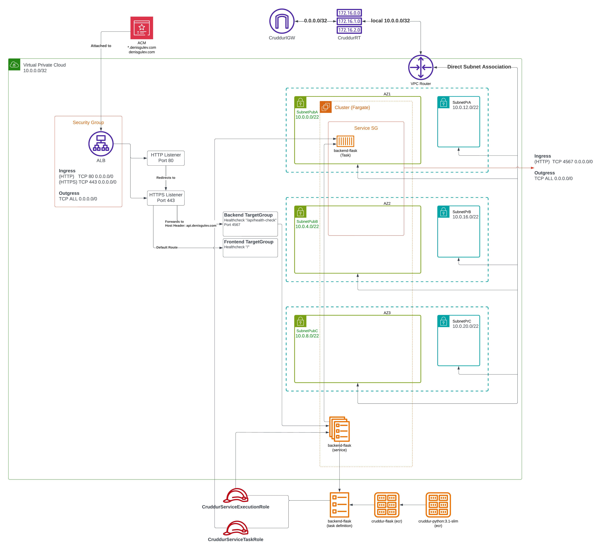
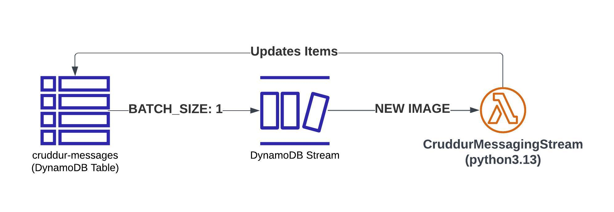
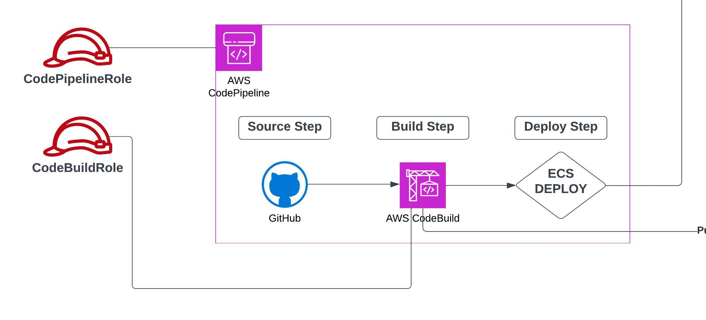

# Week 10 — CloudFormation Part 1

We are going to define multiple layer cloudFormation templates, each containing specifications for particulare resources.

1. Define CloudFormation for ECS fargate
   1. create template for ECS resource
        ```
        AWSTemplateFormatVersion: 2010-09-09
        Description: |
        Setup ECS Cluster
        Resources:
        ECSCluster: # LogicalName
        Type: AWS::ECS::Cluster
        ```
   2. execute "backend-flask/bin/cfn/deploy" script
   3. go to AWS CloudFormation console and review the "changeset"
   4. if everything is ok, go ahead and execute it
   5. in case of errors, take a look at CloudTrail for more details
   6. we can validate the format of our template (json or yaml) using "validate-template" cli command
      or using "cfn-lint"
   7. we can store template in S3 and reference it in the CloudFormation template

    
We'll create multiple layers of CloudFormation templates, each containing specifications for particular resources.

1. Networking -> base networking layer where we deploy service into ("aws/cfn/networking/template.yaml")
   
   In a Template file:
   1. define a VPC resource
   2. define an IGW resource
   3. define a VPCGatewayAttachment resource
   4. define a RouteTable resource
   5. define 2 Routes resources
      1. 1 for the IGW
      2. 1 for the local VPC (setup by default when creating RouteTable)
   6. define Subnet resources
      1. 3 for public subnet
      2. 3 for private subnet
   7. define SubnetRouteTableAssociation resources for each subnet


2. Cluster -> all cluster level resources
   1. we need to pass parameters for Certificates using "cfn-toml"
   see https://www.ruby-toolbox.com/projects/cfn-toml
   2. when the load balancer is up and running, we MUST go to Route 53 and select it to be used


3. Service ->
   1. security groups should be setup as follows:
      1. traffic arrives at ALBSecurityGroup on ports 80 and 443; ALBSecurityGroup must implement inbound rules to handle this traffic
      2. once it arrives at ALB, the traffic is route on internal ports (3000 for FE, 4567 for BE)
   2. define a SecurityGroup -> Allows inbound traffic from the ALB Security Group, restricting it to the specified container port.
   3. define a Fargate Service -> 
      1. Runs as an ECS-managed Fargate service. 
      2. Uses an imported cluster reference. 
      3. Registers with an ALB target group. 
      4. Supports Service Connect for inter-service communication. 
   4. define TaskDefinition -> 
      1. Defines the execution role and task role.
      2. Uses an awsvpc network mode for Fargate compatibility. 
      3. Runs two containers:
      4. X-Ray Daemon for distributed tracing. 
      5. Backend Flask Application configured with health checks, logging, and environment variables. 
      6. Secrets such as database connection URLs and API keys are retrieved from AWS SSM Parameter Store.
   5. define IAM Roles ->
      1. TaskRole:
         - Assigned to the ECS task for service-specific permissions. 
         - Allows SSM communication for remote session management.
      2. ExecutionRole:
         - Used by ECS to pull container images and retrieve secrets. 
         - Grants permissions to interact with Amazon ECR, CloudWatch Logs, and SSM Parameter Store.



4. PostgreSQL DB
   1. **RDS Instance**: A managed PostgreSQL database with configurable parameters such as instance type, backup retention, and deletion protection.
   2. **Database Security Group**: A security group allowing secure access to the database from the application services.
   3. **DB Subnet Group**: Defines subnets for RDS deployment, ensuring proper networking configuration.
   
   ** Notes: 
   1. when the stack is deployed, we need to go to AWS Systems Manager -> Parameter Store and change the value for the connection string.
   2. "MasterUserPassword" is passed through the command line, see "backend-flask/bin/cfn/db-deploy" script


5. DynamoDB
   We are going to use SAM (Serverless Application Model) to deploy DynamoDB.
   1. first we need to install SAM CLI -> https://docs.aws.amazon.com/serverless-application-model/latest/developerguide/install-sam-cli.html
   2. create a template file "aws/cfn/ddb/template.yaml" containing the following resources:
      1.	DynamoDB Table (DynamoDBTable)
            -	A provisioned-mode DynamoDB table with primary key attributes:
            -	pk (Partition Key)
            -	sk (Sort Key)
            -	Includes a Global Secondary Index (GSI) on message_group_uuid and sk.
            -	Enabled DynamoDB Streams with NEW_IMAGE view type.
      2.	AWS Lambda Function (ProcessDynamoDBStream)
            -	ARM64-based Python Lambda function to process DynamoDB Stream events.
            -	Configurable runtime, memory size, and timeout via parameters.
            -	Subscribes to the DynamoDB stream for real-time event processing.
            -	Uses an IAM role for execution (ExecutionRole).
      3.	CloudWatch Logging
            -	Log Group (LambdaLogGroup): Stores logs for the Lambda function with a retention of 14 days.
            -	Log Stream (LambdaLogStream): A specific log stream within the log group.
      4.	IAM Role (ExecutionRole)
            -	Grants the Lambda function permissions to:
            -	Write logs to CloudWatch.
            -	Manage network interfaces.
            -	Invoke other Lambda functions.
            -	Read from DynamoDB Streams.



6. CI/CD
   1. once it is deployed, we need to update the "Connections" in AWS CodePipeline->Settings
   2. In the diagram below:
      1. Build Step -> pushes the image to ECR repository
      2. Deploy Step -> triggers a deploy into ECS Cluster



7. Static Website Hosting on CloudFront
   1. Two S3 Buckets:
        - One for the root domain (e.g., cruddur.example.com).
        - One for the www subdomain (e.g., www.cruddur.example.com), which redirects to the root domain.
   2. CloudFront Distribution:
        - Serves the website securely using HTTPS.
        - Uses an ACM certificate for SSL/TLS encryption.
   3. Route 53 DNS Records:
        - Configures domain names to point to the CloudFront distribution.
   4. S3 Bucket Policy:
        - Grants public read access for website content.